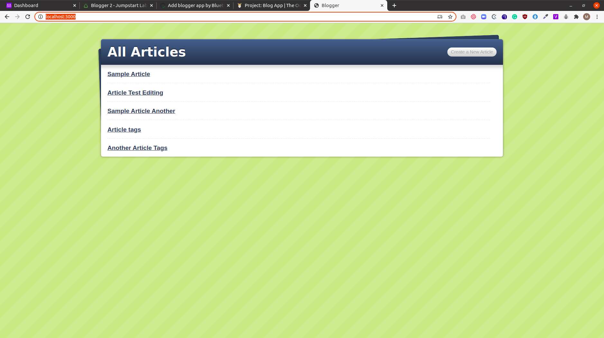

# Blogger

This is a project in the Ruby on Rails curriculum at [Microverse](https:www.microverse.org/) - @microverseinc

The project specifications can be found on [Ruby on Rails
PROJECT: BLOG APP](https://www.theodinproject.com/courses/ruby-on-rails/lessons/ruby-on-rails-ruby-on-rails)



## Built With
- Ruby
- Rails 

## Description
- This is a blogger website. Users can create and comment on posts.

- The Rails framework was used to build this project.

## Live Demo

[Deployed site](http://102.220.85.123/)

### Run instructions 
-  You can clone the GitHub repo and type the following commands in the terminal to run the bot locally 
    ```
    bundle install
    rake db:migrate
    rails server
    ```

### How to use the site

#### Locally

Make sure the server is running
- Go to http://localhost:3000/ in your web browser
- You will be able to access the following routes (among others)
  - http://localhost:3000/articles: where you can view existing articles 
  - http://localhost:3000/tags: where you can view existing articles 
- Follow the links on the site to access the available features.
- In order to create articles first login by clicking on [login](http://102.220.85.123/login). After loging in, you will be able to [add users](http://102.220.85.123/authors/new), create articles, as well as comment on existing ones.

##### Live Site

- For purposes of testing the [deployed site](http://102.220.85.123/), accounts for admin and guest has been added with the following credentials which you can use to login:
    ##### Admin
     - Username: admin
     - Email: admin@example.com
     - Password: password
    ##### Guest
     - Username: guest
     - Email: guest@example.com
     - Password: password

## Deployment
- You can deploy on 
  - [Heroku](https://devcenter.heroku.com/categories/ruby-support).

  - [Cloud server using Capistrano](https://gorails.com/deploy/ubuntu/18.04)

     #### Capistrano Logging Command:
         `tail -f blogger/shared/log/production.log`


## Authors

👤 **Marylene Sawyer**
- Github: [@Bluette1](https://github.com/Bluette1)
- Twitter: [@MaryleneSawyer](https://twitter.com/MaryleneSawyer)
- Linkedin: [Marylene Sawyer](https://www.linkedin.com/in/marylene-sawyer)


# Acknowledgements
- [Blogger2](http://tutorials.jumpstartlab.com/projects/blogger.html#blogger-2)


## 🤝 Contributing

Contributions, issues and feature requests are welcome!

Feel free to check the [issues page](https://github.com/Bluette1/minderly-bot/issues).

## Show your support

Give a ⭐️ if you like this project!

## 📝 License

This project is [MIT](https://opensource.org/licenses/MIT) licensed.
